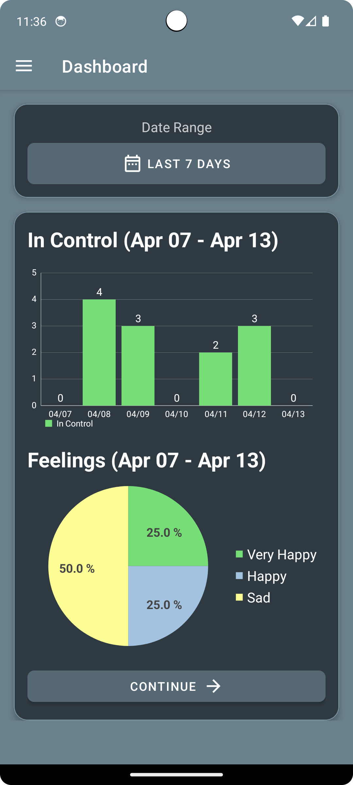
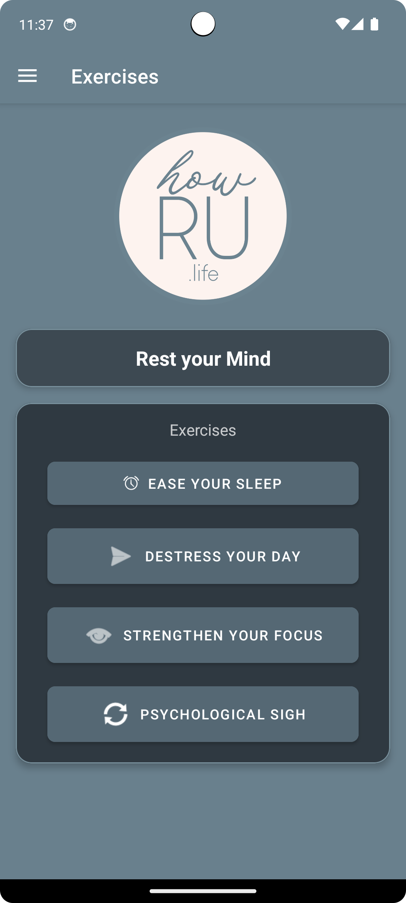
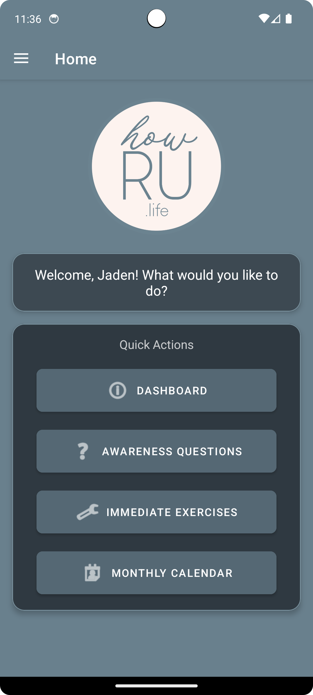

# Stress Management App 📱

Manage anxiety and stress with this Android app, powered by Firebase.

---

## Features 🚀
- **User Authentication** 🔐
- **Data Storage with Firebase Firestore** ☁️
- **Daily Notifications** ⏰
- **Interactive and User-Friendly UI** 🖌️

---

## Directory Structure 🗂️

 Code/
├── Source/                # Complete Android Studio project files
│   ├── app/               # Application module with source code and resources
│   ├── gradle/            # Gradle wrapper files
│   ├── build.gradle       # Project-level build file
│   ├── settings.gradle    # Gradle settings file
│   └── README.md          # Description of source files
├── Deployable/            # Debug and release APKs
│   ├── app-debug.apk      # Debug build APK
│   ├── app-release.apk    # Release build APK
│   └── README.md          # Deployment instructions
├── Database/              # Firebase configuration
│   ├── google-services.json # Firebase configuration file
│   └── README.md          # Firebase setup instructions
├── Documentation/         # Installation guide, user manual, and developer guide
│   ├── Installation_Guide.pdf # Steps to install the project
│   ├── User_Manual.pdf        # User guide
│   └── Developer_Guide.pdf    # Developer reference
├── Tests/                 # Test cases and reports
│   ├── UnitTests/         # Unit test cases
│   ├── InstrumentationTests/  # Instrumentation test cases
│   ├── TestReports/       # Generated test reports
│   └── README.md          # Instructions to run tests

Screenshots 📷

Building the APKs 📦
	1.	In Android Studio, go to:
 Build > Build Bundle(s)/APK(s) > Build APK(s)
 	2.	The APKs will be located in:
  Source/app/build/outputs/apk/

  Tests ✅

Unit Tests
	•	Located in:
 Source/app/src/test/
 
  To run unit tests, use the Run menu in Android Studio or execute:
    ./gradlew test

  To run instrumentation tests on a connected device or emulator: 
   ./gradlew connectedAndroidTest

 Contributing 🤝

Contributions are welcome! To contribute:
	1.	Fork the repository.
	2.	Create a new branch:
 git checkout -b feature-name

	3.	Commit your changes:
 git commit -m "Add your message here"

 	4.	Push to your fork and create a pull request.

  
This project is licensed under the MIT License.

